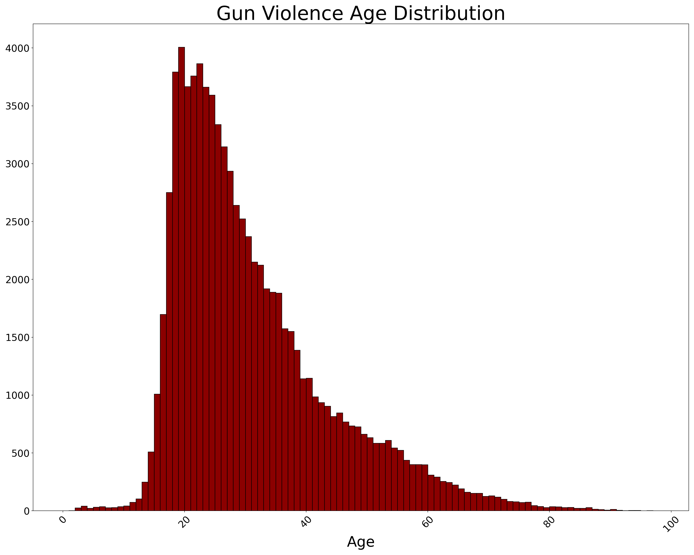
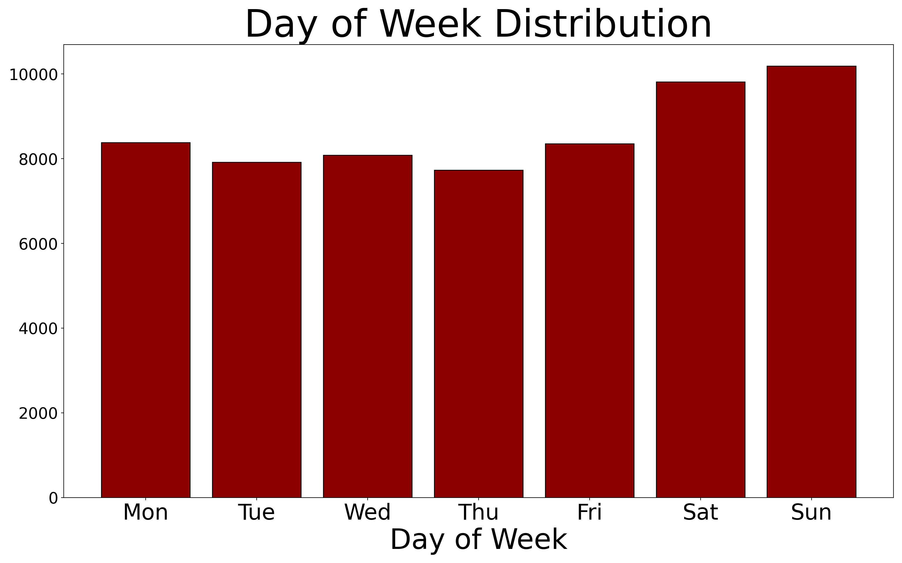

# Gun Violence EDA and Predictive Modeling

This repository contains analysis and predictive models for data for all recorded gun violence incidents in the US between January 2013 and March 2018, inclusive. Gun violence is a pervasive issue in the US. We seek to develop a greater understanding so as to find what areas would be best focused on to curb gun violence.


## Where did you get the data?

The data was sourced from [James Ko's Github repository](https://github.com/jamesqo/gun-violence-data/tree/master), who scraped the Gun Violence Archive's website. 

## Data Dictionary

The data is stored in a single CSV file sorted by increasing date. It has the following fields:

| field                   | type         | description                                                               | required? |
|-----------------------------|------------------|-------------------------------------------------------------------------------|---------------|
| incident_id                 | int              |                 gunviolencearchive.org ID for incident                        | yes           |
| date                        | str              |                           date of occurrence                                  | yes           |
| state                       | str              |                                                                               | yes           |
| city_or_county              | str              |                                                                               | yes           |
| address                     | str              | address where incident took place                                             | yes           |
| n_killed                    | int              | number of people killed                                                       | yes           |
| n_injured                   | int              | number of people injured                                                      | yes           |
| incident_url                | str              | link to gunviolencearchive.org webpage containing details of incident         | yes           |
| source_url                  | str              | link to online news story concerning incident                                 | no            |
| incident_url_fields_missing | bool             | ignore, always False                                                          | yes           |
| congressional_district      | int              |                                                                               | no            |
| gun_stolen                  | dict[int, str] | key: gun ID, value: 'Unknown' or 'Stolen'                                     | no            |
| gun_type                    | dict[int, str] | key: gun ID, value: description of gun type                                   | no            |
| incident_characteristics    | list[str]        | list of incident characteristics                                              | no            |
| latitude                    | float            |                                                                               | no            |
| location_description        | str              | description of location where incident took place                             | no            |
| longitude                   | float            |                                                                               | no            |
| n_guns_involved             | int              | number of guns involved                                                       | no            |
| notes                       | str              | additional notes about the incident                                           | no            |
| participant_age             | dict[int, int] | key: participant ID                                                           | no            |
| participant_age_group       | dict[int, str] | key: participant ID, value: description of age group, e.g. 'Adult 18+'        | no            |
| participant_gender          | dict[int, str] | key: participant ID, value: 'Male' or 'Female'                                | no            |
| participant_name            | dict[int, str] | key: participant ID                                                           | no            |
| participant_relationship    | dict[int, str] | key: participant ID, value: relationship of participant to other participants | no            |
| participant_status          | dict[int, str] | key: participant ID, value: 'Arrested', 'Killed', 'Injured', or 'Unharmed'    | no            |
| participant_type            | dict[int, str] | key: participant ID, value: 'Victim' or 'Subject-Suspect'                     | no            |
| sources                     | list[str]        | links to online news stories concerning incident                              | no            |
| state_house_district        | int              |                                                                               | no            |
| state_senate_district       | int              |                                                                               | no            |

Important notes:

- Each list is encoded as a string with separator `||`. For example, `"a||b"` represents `['a', 'b']`.
- Each dict is encoded as a string with outer separator `||` and inner separator `::`. For example, `0::a, 1::b` represents `{0: 'a', 1: 'b'}`.
- The "gun ID" and "participant ID" are numbers specific to a given incident that refer to a particular gun/person involved in that incident. For example, this:

  ```
  participant_age_group = 0::Teen 12-17||1::Adult 18+
  participant_status = 0::Killed||1::Injured
  participant_type = 0::Victim||1::Victim
  ```

  corresponds to this:

  |                    | Age Group | Status | Type |
  |--------------------|---------------|------------|----------|
  | **Participant #0** | Teen 12-17    | Killed     | Victim   |
  | **Participant #1** | Adult 18+     | Injured    | Victim   |

## Additional notes

- The list of incidents from 2013 is not exhaustive; only 279 incidents from that year were catalogued.
- 2 incidents were manually removed from the dataset: the [Las Vegas mass shooting incident](http://www.gunviolencearchive.org/download/las-vegas-shooting.pdf) and [incident 1081885](http://www.gunviolencearchive.org/incident/1081885).
  - The Las Vegas mass shooting had to be removed because information about the incident was stored in a PDF, which caused scraping to fail since the scraper expects an HTML webpage.
  - Incident 1081885 had to be removed because the location details were not parsing nicely.
  - PRs to manually add back either/both of these incidents are welcome. (Please edit the `stage1` files in `intermediate/`)
- Known issue: the `address` field should be required, but is missing for ~16k incidents.
- Please provide credit to and notify Gun Violence Archive if you intend to use this dataset in your project. [Read their terms here.](http://www.gunviolencearchive.org/about)

# Modeling Target
Both number of casualties and if there are casualties

# Features Used for Modeling
A * means that these features are generated prior to modeling.
- state
- latitude
- longitude
- number of guns involved
- location description
- notes
- *day of week (Note: Python by default sets day 0 to be Monday. Why? I don't know but it's madness I tell you)
- *month
- *suspect age
- *suspect age group
- *suspect gender
- *number of stolen guns involved
- *gun types involved
- *incident characteristics (with characteristics that revealed the outcome removed)

*Derived form the fields in the data dictionary

# Preprocessing
- removed incident characteristic flags that revealed whether or not there was a casualty
- missing age imputed as mean age
- missing number of guns imputed as 1 (there must be at least 1 gun, and the majority of cases only involve one gun)
- missing gender set to 'unknown'
- location description and notes were tf-idf vectorized
- One hot encoding for state and gender

# Models Tried
- Logistic Regression
- Linear Regression

Note that models were all fit using a grid search with 5 fold cross validation to find the optimal parameters.

# Executive Summary

The purpose of this project was to explore gun violence in America and identify where best to allocate resources to curb gun violence. This was accomplished via traditional analytical techniques as well as exploring the coefficients of "whitebox" predictive models.

The data was sourced from a Github repo created by James Ko (see link in data dictionary section) who scraped the data from the Gun Violence Archive. The dataset contains information about where and when gun violence occured, as well as surrounding information like details regarding the individuals involved and the number of casaulties. The dataset spans 2013-2018 and contains information on roughly 240,000 gun violence incidents across the United States.

Much EDA was performed and the slide deck is the best way to get that information, but below are some highlights:

The overwhelming majority of perpetrators of gun violence are young (between 12 and 30) with the highest frequency in early 20s/late teens.


The overwhelming majority are male, with 93% of incidents having male perpepatrators.

Gun violence occurs most frequently on Saturday and Sunday, with Thursday being the lowest.


Gang activity, gun-related suicides, and mass shootings all peak during summer and are lowest in winter.

There are almost no school shootings during summer (duh), but school shooting frequency has been increasing over time.

Please see the slides for statewide trends.

Feature engineering involved unpacking columns that were originally stored as string lists or dictionaries, removing incident characteristic flags that revealed the outcome (if there was a casualty), imputation of missing data for age, number of guns, and gender. Then approprate columns were tf-idf vectorized or one-hot-encoded.

Two models were fitted, a linear regression predicting number of casualtes and a logistic regression predicting if there were casualties. The linear regression had an accuracy of 77% and the logistic regresison had a train r2 score of 0.899 and a test r2 score of 0.896. The coeficents of both were then analyzed to see what inputs were the strongest indicators of potential casualties.

Some of the strongest indicators for having casualties were the following
- Terrorism Involvement
- Incidents involving parties and bars/clubs
- Being in Alaska or Arizona
- Gang Involvement

Some of the strongest indicators for NOT having casualties were the following:
- Incident involved a robbery
- Being in Wyoming, Massachusetts, New Hampshire, or Maine
- Incidents where the perpatrator is under the influence of drugs or alcohol

In conclusion, the group that commits the most gun violence is young males and we recommend that resources be focused on education of young males to minimize gun violence. We also would like to reiterate that you are least likely to get shot on Thursday and you should feel especially safe on a Thursday in Wyoming when you're being robbed.

If we were to continue this project, we would like to gather data for additional periods of time, as well as incorporate other data like socioeconomic data and legislative data to see a broader picture about how gun violence interacts with these additional variables.